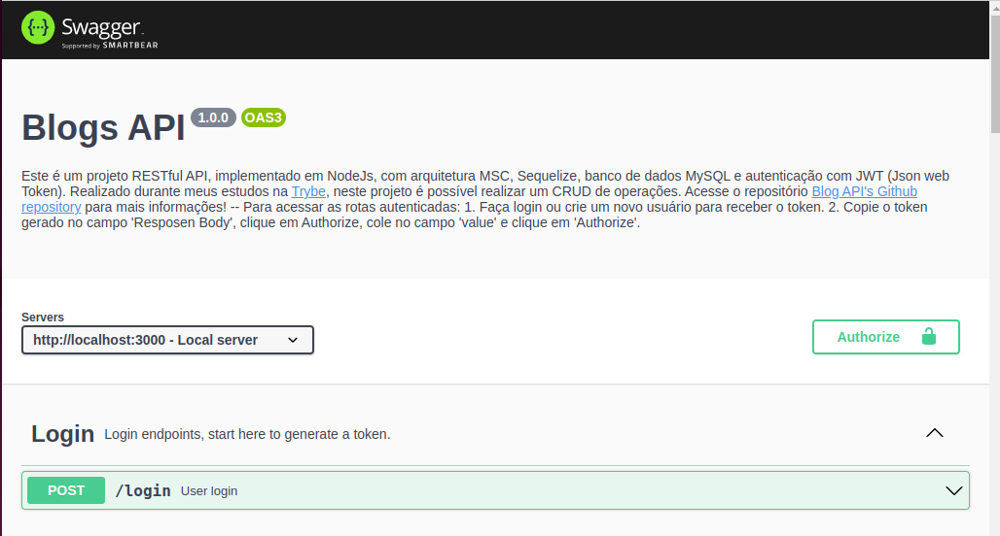

# 💻 Blogs API

<!--  -->

## 📡 Sobre
#

Este é um projeto RESTful API, implementado em NodeJs, com arquitetura MSC, Sequelize, banco de dados MySQL e autenticação com JWT (Json web Token). Realizado durante meus estudos na <a href="https://betrybe.com/" target="_blank">Trybe</a>, neste projeto é possível realizar um CRUD de operações.

<br />

## 🚀 Instalação e execução
#

<details>
<summary>Instalando e executando com Docker</summary>
<br />

Para rodar está aplicação é necessário ter **Git**, **Docker** e o **Docker Compose** instalados no seu computador. O Docker Compose precisa estar na versão **1.29** ou superior.

### 1 - Clone o repositório:

```
git clone git@github.com:vschagas/Blogs_Api.git
```

### 2 - Na raíz do projeto, suba os containers `blogs_api` e `blogs_api_db` utilizando o docker-compose.

    docker-compose up -d

### 3 - Abra o terminal do container `blogs_api`.

    docker exec -it blogs_api bash

### 4 - No terminal do container, instale as dependências com o comando:

    npm install

### 5 - Agora execute os comandos para criar e popular o banco de dados:

Criando as tabelas

    npm run prestart

Populando o banco com dados

    npm run seed

<!-- ### 6 - Agora execute a aplicação com o comando:

    npm start

Para conferir a cobertura de testes execute o comando:

    npm run test-coverage -->

</details>
<br />

## 📚 Documentação
#

Acesse a rota http://localhost:3000/documentation para acessar a documentação e testar a API. Se preferir, utilize um cliente de requisições HTTP de sua preferência (Insomnia, Thunder Client, etc) para fazer as requisições.

<br />



<br />

## 🛠️ Tecnologias
#

- Node.js
- Express.js
- Sequelize.js
- Docker
- MySQL
- JWT
- Joi
- Swagger

<!-- # -->

<!-- ## 🧪 Cobertura de testes


# -->

